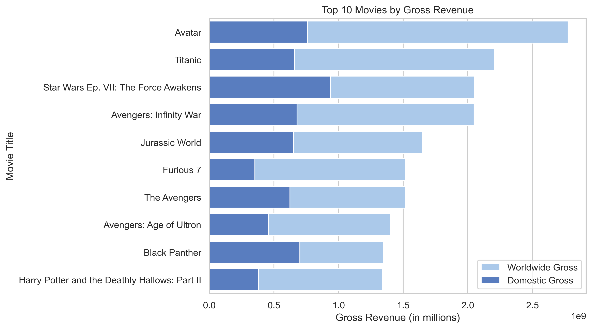
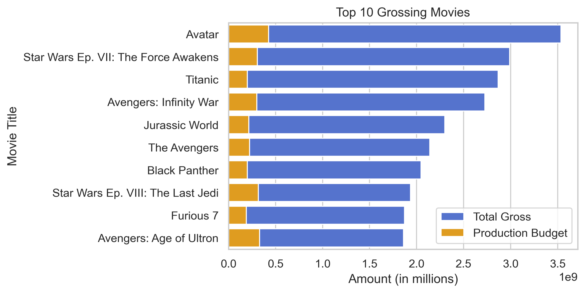

# Microsoft Film Studio Analysis

### Author: John Castro

## Overview
This project analyzes film data to provide three recommendation for Microsoft in their expansion into film studio production. Descriptive analysis of box office success data shows that top grossing films share similarity that can be replicated. Microsoft can use this analysis to find their brand, mirror the success of others, and innovate with exemplary talent.

## Business Understanding
Microsoft may be able to ensure early success by understanding the competition and branding themselves to go with or against the grain.

## Data Understanding
Data was gathered from various credible sources to gain knowledge of films and their success in the industry. The data showed us film success in terms of gross revenue, domestic and international, and the budgets for these films. The genre of the films were determined to see which genres encompass the top films in the industry.

## Exploratory Data Analysis 
**Top ten grossing movies** ranked by their total gross revenue, with each movie represented by two bars: one for its domestic gross revenue (shown in blue) and one for its international revenue (shown in pale blue).

The chart shows that the movies with the highest total gross revenue are not necessarily the ones with the highest production budget.

## Conclusion
Microsoft's new movie studio represents a major step forward for the company. By entering the film industry, Microsoft has an opportunity to leverage its existing strengths in technology and entertainment to create compelling content and engage audiences in new and exciting ways.

### Limitations
Some limitaions may include, lack of experience, tough competition, and changing comsumer preferences. On top of all of this, there is the inherent financial risk in breaking into an already vibrant industry.

## Recommendations
The analysis leads to three recommendations to success in the industry.

**Establish a clear and compelling brand:** Microsoft should position themselves as a studio that produces high-quality content that resonates with audiences around the world. One characteristic should include blockbuster entertainment as the highest-grossing films tend to be big-budget, action-packed blockbusters that appeal to a wide audience.

**Hire experienced professionals:** These individuals have the key benefits of expertise, network, and reputation. When navigating a new endevour it is a good idea to have some experience on your side.

**Be patient and persistent:** Success is defined in a multitude of ways and it is important to understand your vision of success.

## Next Steps
**Establish partnerships and collaberations:** this will allow the department to grow and learn from individuals and entities in the industry.

**Develop a diverse and inclusive team:** this will allow the department to reach the largest audience and increase awareness to the global economy of the industry.

**Embrace innovative new technologies:** this will increase productivity, production and overall quality of the output. Look to embrace new technology and create your own in addition.

## For more information
See full analysis in [Jupyter Notebook](code.ipynb) or review this [presentation](Microsoft_Presentation.pdf).
For additional information please contact John Castro, johncastro2013@gmail.com.

## Repository Structure
├── dsc-phase-1-project-v2-4
├── images
├── .gitignore
├── README.md
├── code.ipynb
├── Microsoft_Presentation.pdf
└── movie_budgets.csv
